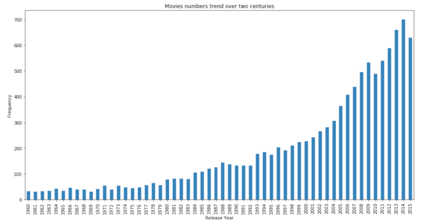

### Investigate_Movies_Dataset

Python version:3.7

Udacity's data analyst Nano Degree project

The Movie Database (TMBd) is a movie and TV database which offers information such as user ratings (popularity, user votes), budget, revenue, title, cast, duration, genres and release dates. All data is added by the TMBd community. For more information, please visit their official website .

## In this project, I will be answering the following questions:

1. Analyse trend over the years and over two centuries in terms of the number of movies produced
2. Movie popularity Trend over the years
3. Analysing Rating Average
4. Relationship between release year and vote average
5. What are the 25 most rated movies?
6. Top 25 popular/high rating data filtered by years
7. The relationship between runtime and vote average?
7. Analysing Genres by defining the 3 most/least commen genres

## Conclusion

> This data set contains information about movies collected from The Movie Database (TMDb), including user ratings ratings, revenue, runtime and budget.

> After diving deep in the data, I found that the data set has 10688 records, with 10571 unique Movie titles. First I focused on the Budget and Revenue. I thought that would be an interseting and important part to analyse. However, I found out that about 52% of the records missing  Budget value, while about 55% are missing Revenue value. 

> This limitation of the database is due to missing a huge amount of important values.  It is not logical or even accurate to fill these missing values with Average, delete them or to even anlayse. In these Scenarios, this  will lead either to wrong analysis which will lead to wrong predictions or biased analysis. 
If these values are availabe in the dataframe, a lot of analysis would be done. For example: Compare the budget and the revenue, pull out the top 10 revenue earning movies, What genres are associated with movies that have high revenues? Explore what month(s) have the highest revenues etc..

> The conclusion after the analysing:

> There is a strong increase in the number of movies produced, escpeically in the 1980s.That is due to satallite and the Inernet technology, that also affects the increase of the amount of movies by the end of last century and this century. This increase is due to the advanced filmmaking technology, which makes the film industry easier and faster. However, there is a slight decline in 2015 in comparision with the pick 2014. Inspite of there is a decline in the number os movies produced in 2015. I found it interesting that 20% of the best 25 rated movies filtered by years are in 2010. That concludes that the quality is more important than quantity.

> On average, in recent years popularity in movies has been increasing. The trend is reasonable due to easily access of movie information nowadays. In the Internet age, people can easily search and gather movie information, visit various movie introduction pages, rate movies, even watching the content through different sources. This is probably what affects how popular a movie can be.

> The relationship between runtime and vote average?: Short films are likely to have a mid-to-high rating. Movies with a runtime around 100 minutes tend to have an unpredictable rating, as they can run from low to high. Films/shows with a runtime above or below 100 minues tend to have mid-to-high ratings. Tv series and movies with long runtime consistently get higher-than-average ratings. 

> Relationship between release year and vote average: During the 1960s technology was not as advanced as it is right now. At that time, the only way to rate a movies was using paper. The increase of rating average started in the 1980s which is also reasonable, due to the beginnning of the advanced technology making it easier to rate movies.

> Finally, when I analysed the genre, I noticed that only of the highet earning genres is in the top 3 most frequently produced genres: Drama, Comedy and Thriller. 

